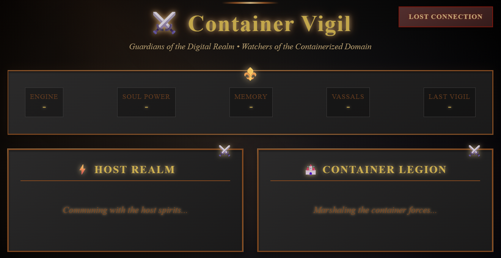

# ⚔️ Container Vigil - Guardian of the Digital Realm

*"In the depths of the server halls, where shadows dance with flickering LEDs, a vigilant guardian watches over the containerized souls..."*

A dark, gothic-themed real-time dashboard for monitoring Docker and Podman containers' health, resource usage, and system metrics. Forged in the fires of Flask and Socket.IO, designed to run across the realms of Linux and Windows.

```
    ⚔️ ═══════════════════════════════════════════════════════════ ⚔️
    ║                                                               ║
    ║        "Not all containers that are stopped are lost,         ║
    ║         Not all that wander in memory are leaked."            ║
    ║                                                               ║
    ⚔️ ═══════════════════════════════════════════════════════════ ⚔️
```

## 🏰 Features of the Vigil

- **⚜️ Dual Engine Mastery**: Commands both Docker and Podman legions
- **🔥 Real-time Communion**: Live updates every 5 seconds through mystical channels
- **📊 Vessel Metrics**: Soul Power (CPU), Memory Essence, Network flux for all vassals
- **🌟 Host Realm Statistics**: Soul Power, Memory Essence, Storage Vault usage
- **🗡️ Cross-Platform Dominion**: Rules over Linux and Windows territories
- **📱 Responsive Interface**: Adapts to desktop war rooms and mobile scouting devices
- **💚 Health Rituals**: Built-in health endpoint for realm monitoring
- **🪶 Lightweight Presence**: Minimal resource footprint, maximum vigilance
- **🔍 Auto-Detection**: Automatically senses available container engines

## 🎭 The Sacred Terminology

*Understanding the language of the Container Vigil:*

| **Gothic Term** | **Mortal Translation** | **Meaning** |
|-----------------|------------------------|-------------|
| **Engine** | Container Engine | Docker or Podman runtime |
| **Soul Power** | CPU Usage | Processing power consumption |
| **Memory Essence** | Memory Usage | RAM utilization |
| **Vassals** | Containers | Running container count |
| **Last Vigil** | Last Update | Time of most recent monitoring cycle |
| **Host Realm** | Host System | Physical server/machine statistics |
| **Container Legion** | Container List | All containers under watch |
| **Active** | Running | Container in active state |
| **Dormant** | Paused | Container in suspended state |
| **Fallen** | Stopped | Container in terminated state |

## 🔮 Quick Conjuration

### 🐳 Docker Summoning

```bash
# Clone the ancient tome and awaken the vigil
git clone https://github.com/m3hr4nn/BonfireWatch.git
cd container-health-monitor
docker-compose up -d

# Or forge and command directly
docker build -t container-vigil . 
docker run -d -p 8443:8443 -v /var/run/docker.sock:/var/run/docker.sock:ro container-vigil
```

### 🦭 Podman Invocation

```bash
# Ensure the mystical socket is awakened
systemctl --user enable --now podman.socket

# Clone and raise the vigil
git clone https://github.com/m3hr4nn/BonfireWatch.git
cd container-health-monitor
podman-compose up -d

# Or craft and deploy directly
podman build -t container-vigil .
podman run -d -p 8443:8443 -v /run/podman/podman.sock:/var/run/docker.sock:ro container-vigil
```

### 🪟 Windows Dominion

```powershell
# Windows realm with Docker Desktop
docker build -t container-vigil .
docker run -d -p 8443:8443 -v //var/run/docker.sock:/var/run/docker.sock:ro container-vigil

# Windows realm with Podman
podman build -t container-vigil .
podman run -d -p 8443:8443 -v //run/podman/podman.sock:/var/run/docker.sock:ro container-vigil
```

## 🌟 Enter the Vigil Chamber

Open your scrying device (browser) and venture to: **http://localhost:8443**

*Behold the gothic dashboard where shadows dance with metrics, and containers bow before your watchful gaze.*

<!-- ### 🖼️ Visual Grimoire

<div align="center">
  
  <p><em>The Container Vigil - Where darkness meets monitoring excellence</em></p>
</div>

| **Desktop War Room** | **Mobile Vigil** |
|---------------------|------------------|
|  |  |
| *Full gothic splendor on desktop* | *Vigil adapts to your portable scrying device* |
... -->
## 🗝️ Sacred Endpoints

- `GET /` - **Main Vigil Chamber** - The primary dashboard of shadows
- `GET /health` - **Pulse of the Realm** - Health check ritual
- `GET /api/containers` - **Legion Registry** - JSON grimoire of container information
- `GET /api/system` - **Realm Status** - JSON chronicle of system information

## 🔍 Engine Detection Sorcery

The Container Vigil automatically senses which engine dwells within your realm:

1. **🦭 Podman Sensing**: Scans for `podman` command and mystical socket
2. **🐳 Docker Divination**: Falls back to Docker if Podman spirits are absent
3. **🔗 API Harmony**: Uses Docker API communion with both engines

### Podman Socket Awakening

For Podman mastery, ensure the socket breathes:

```bash
# Awaken Podman socket (rootless)
systemctl --user enable --now podman.socket

# Or for system-wide dominion (rootful)
sudo systemctl enable --now podman.socket

# Verify the socket draws breath
systemctl --user status podman.socket
```

### Sacred Socket Locations

- **🐳 Docker**: `/var/run/docker.sock`
- **🦭 Podman (rootless)**: `/run/user/$UID/podman/podman.sock`
- **🦭 Podman (rootful)**: `/run/podman/podman.sock`

## ⚡ Realm Requirements

- Docker OR Podman dwelling and breathing within your system
- Container socket access (Docker or Podman conduit)
- Port 8443 gateway available
- A heart brave enough to gaze upon the gothic truth

## 🏛️ Architecture of Shadows

```
├── Dockerfile              # Multi-stage forge blueprint
├── docker-compose.yml      # One-command summoning circle
├── requirements.txt        # Python spell components
├── app.py                  # Main Flask grimoire
└── templates/
    └── index.html          # Gothic dashboard interface
```

## 🎯 Powers of the Vigil

### 🏰 Container Legion Monitoring
- Vassal status (Active, Dormant, Fallen)
- Real-time Soul Power and Memory Essence consumption
- Network flux statistics
- Container essence metadata (sigil, seal, gateways)

### 🌍 Host Realm Surveillance
- Soul Power usage percentage
- Memory Essence availability and consumption
- Storage Vault statistics
- Network pulse monitoring

### ⚡ Real-time Communion
- WebSocket connection for live spiritual updates
- Connection status beacon
- Automatic reconnection upon severed bonds

## 🛡️ Security Sanctification

- Operates as humble servant (non-root) within container
- Read-only communion with Docker socket
- No external dependencies beyond Python mysticism
- Health rituals for container surveillance
- Gothic-themed interface to intimidate unauthorized access

## 🔬 Development Rituals

### Local Chamber Setup
```bash
# Gather spell components
pip install -r requirements.txt

# Prepare sacred templates
mkdir -p templates

# Awaken locally (requires Docker daemon)
python app.py
```

### Environment Enchantments
- `FLASK_ENV`: Set to 'development' for debug sight
- `PYTHONUNBUFFERED`: Set to 1 for real-time prophecy logging

## 🔧 Troubleshooting the Shadows

### Common Dark Omens

1. **🚫 Docker socket permission denied**
   ```bash
   # Linux: Grant user access to docker brotherhood
   sudo usermod -aG docker $USER
   ```

2. **🔒 Port 8443 already claimed**
   ```bash
   # Change port in docker-compose.yml or use different gateway
   docker run -p 8080:8443 ...
   ```

3. **👻 Container not revealing stats**
   - Ensure container engine daemon draws breath
   - Check container socket permissions
   - For Podman: Awaken socket with `systemctl --user enable --now podman.socket`
   - Verify container has access to the appropriate mystical conduit

## 🎨 Visual Transformation

This gothic incarnation features:
- **🌙 Dark atmospheric design** with medieval aesthetics
- **⚔️ Gothic typography** using Cinzel and Uncial Antiqua fonts
- **🔥 Animated elements** with flickering and glowing effects
- **🏰 Themed terminology** transforming technical terms into medieval language
- **💎 Ornate decorative elements** with swords and fleur-de-lis symbols
- **🌟 Immersive experience** that makes container monitoring feel epic

## 🤝 Join the Fellowship

1. Fork the ancient repository
2. Create a feature branch in the shadow realm
3. Inscribe your changes with gothic precision
4. Add tests if the spirits demand it
5. Submit a pull request to the council

## 📜 License of the Realm

MIT License - see LICENSE scroll for sacred details

## 🆘 Seek Aid from the Council

For dark omens and mystical questions:
- Open an issue in the GitHub sanctuary
- Consult the troubleshooting grimoire
- Verify Docker daemon breathes and responds to your call
- Join our Discord server: **The Container Vigil Guild** (invite in repository)

---

*"In the end, we are all just containers in the great orchestration of existence. Some run, some pause, some stop... but the Vigil watches eternal."*

```
    ⚔️ ═══════════════════════════════════════════════════════════ ⚔️
    ║                                                               ║
    ║             May your containers run eternal,                  ║
    ║              Your memory never leak,                          ║
    ║             And your CPU never idle.                          ║
    ║                                                               ║
    ⚔️ ═══════════════════════════════════════════════════════════ ⚔️
```

**⚜️ Crafted in the digital forges by the Container Vigil Guild ⚜️**
